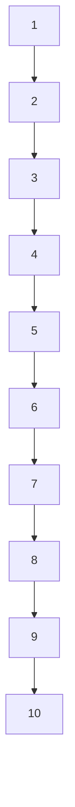

# Rotating Binary Search Trees [Slides](https://docs.google.com/presentation/d/1cN8B7AT30M_kaDgBa4UKt36OqhCdEVwjI0jOYtXxrP8/edit?slide=id.p1#slide=id.p1)

## Goal  
Every balanced tree you will ever use in production (Java `TreeMap`, C++ `std::map`, database B-tree indexes, Python’s sorted containers) rests on one primitive: the tree rotation. Today you learn exactly how rotations keep BST height O(log n) no matter the insertion order — turning the worst-case nightmare of a linked-list tree into guaranteed logarithmic performance.

## Learning Objectives
By the end of class students will be able to:
- Identify when a BST has become unbalanced and why that destroys performance
- Perform left and right rotations (and the four AVL combinations) on paper or whiteboard
- Explain AVL height-balance rule and rebalancing during insert
- Describe splay-tree access and why it gives amortized O(log n)
- Compare AVL (strict) vs splay (locality-aware) trade-offs

## Agenda (50-minute online class)
1. Hook + plain BST review (0–5 min)  
2. Rotations — intuition & live practice (5–20 min)  
3. AVL trees — strict balancing (20–35 min)  
4. Splay trees — self-adjusting magic (35–45 min)  
5. Comparison, Q&A, homework (45–50 min)

## Materials & Prep (do before class starts)
- Duplicate the sample deck → keep exact theme, fonts, colors, whitespace (blue/teal accents, heavy tree visuals)  
- Open tabs ready to share:  
  - VisuAlgo BST: https://visualgo.net/bst  
  - USF AVL viz: https://www.cs.usfca.edu/~galles/visualization/AVLtree.html  
  - USF Splay viz: https://www.cs.usfca.edu/~galles/visualization/SplayTree.html  
- Vaidehi Joshi BaseCS article (beautiful drawings): https://medium.com/basecs/the-little-avl-tree-that-could-86a3cae410c7  
- Zoom whiteboard or Jamboard for rotation drills
- Poll tool ready for “AVL or Splay for a hot-key cache?”

## Detailed Flow & Teaching Notes

**1. Hook (0–5 min)**  
Show this degenerate tree:



Intuition: “Sorted inserts turn our log n search into linear scan. Rotations are the local surgery that fixes the lean without rebuilding the whole tree.”

**2. Rotations — intuition → example → mechanics (15 min)**  
Intuition: Rotation is like rotating a mobile — the in-order traversal never changes, only the shape.  
Live example (use USF or VisuAlgo): insert 1,2,3 → right-skew. Perform right rotation at root.  

**Mechanics (show both on whiteboard):**
- Right rotation on node X (X has left child Y): Y becomes new root, X becomes Y’s right child, Y’s original right becomes X’s left.  
- Left rotation symmetric.  

Activity (5 min)

Everyone rotates the same three trees on Jamboard. Call on 2–3 students to explain.

**Right Rotation Mechanics:**

```pseudocode
right_rotate(X):
  Y = X.left
  X.left = Y.right
  Y.right = X
  return Y
```

**3. AVL trees (15 min)**  
Balance condition: for every node, |height(left) – height(right)| ≤ 1.  
Four violation cases after insert (LL, RR, LR, RL).  
Live demo in VisuAlgo: insert sequence that triggers double rotation (LR).  

Deeper mechanics:  
- Store height in each node (O(1) extra space).  
- After insert, walk back up and fix first unbalanced ancestor.  
- Single rotation for LL/RR, double for LR/RL.  

**4. Splay trees (10 min)**  
No height bookkeeping.  
Rule: every time you access (search/insert) a node, splay it all the way to the root using zig, zig-zig, zig-zag rotations.  
Intuition: “Recently used items live near the root — free cache effect.”  
Demo in USF Splay viz: repeated access to same key makes tree almost flat for that key.

**5. Wrap & comparison (5 min)**  

| Feature       | AVL                  | Splay                  |
|---------------|----------------------|------------------------|
| Balance       | Strict (always ≤1)   | None — amortized       |
| Extra space   | height field         | None                   |
| Worst single op | O(log n) guaranteed | O(n) possible          |
| Best for      | Predictable latency  | Hot-key / cache access |

Homework (assign in last 2 min):
1. Read Vaidehi Joshi article + watch MIT golden-ratio segment (first 8 min).  
2. Play VisuAlgo AVL for 10 min and screenshot one double rotation.  
3. (Optional stretch) Implement AVL insert in Python starter below.

```python
class Node:
    def __init__(self, key):
        self.key = key
        self.left = self.right = None
        self.height = 1

# TODO: height(), balance_factor(), rotate_right(), rotate_left(), insert()
```

Exit ticket (chat or poll): “Draw the tree after a left-right rotation on this sketch.”

### Next Steps for Students
- Next class: Red-Black trees (rotations + color rules)  
- Project tie-in: use AVL in your ordered-set assignment

## Rotating Binary Search Trees (Outline)

### Slides

You can see the slides [here](https://docs.google.com/presentation/d/1dNxjecHEiY9uJ2qs7a1nnK_2UZaYBDG5IzOfCwPLHP4/edit#slide=id.p)

### Topics

- [Self-balancing binary search trees] with [rotations]: [AVL tree], [splay tree]

### Resources

- Read Vaidehi Joshi's [AVL tree article][BaseCS AVL tree] with beautiful drawings
- Play with VisuAlgo's [interactive AVL tree visualization][VisuAlgo bst] to follow rotations step-by-step
- Watch MIT's [AVL tree video lecture] to learn how maximum tree height is related to the golden ratio
- Read Julia Geist's [AVL tree article] and [AVL tree slides] with animations and code samples
- Play with USF's [interactive animations of AVL trees][USF AVL tree] and [splay trees][USF splay tree]


[self-balancing binary search trees]: https://en.wikipedia.org/wiki/Self-balancing_binary_search_tree
[rotations]: https://en.wikipedia.org/wiki/Tree_rotation
[AVL tree]: https://en.wikipedia.org/wiki/AVL_tree
[splay tree]: https://en.wikipedia.org/wiki/Splay_tree
[red-black tree]: https://en.wikipedia.org/wiki/Red%E2%80%93black_tree

[binary search tree resources]: https://github.com/Product-College-Courses/CS-3-Core-Data-Structures/blob/master/Class9.md
[BaseCS AVL tree]: https://medium.com/basecs/the-little-avl-tree-that-could-86a3cae410c7
[AVL tree slides]: https://docs.google.com/presentation/d/1ZTq_DbxTpnnTMw5GvF4TNJZV7P0k1UGwmm40-SBgfM8/edit
[AVL tree article]: https://medium.com/@julia.geist/c8cef61d3ea1
[AVL tree video lecture]: https://www.youtube.com/watch?v=FNeL18KsWPc
[VisuAlgo bst]: https://visualgo.net/bst
[USF AVL tree]: https://www.cs.usfca.edu/~galles/visualization/AVLtree.html
[USF splay tree]: https://www.cs.usfca.edu/~galles/visualization/SplayTree.html
[USF red-black tree]: https://www.cs.usfca.edu/~galles/visualization/RedBlack.html
