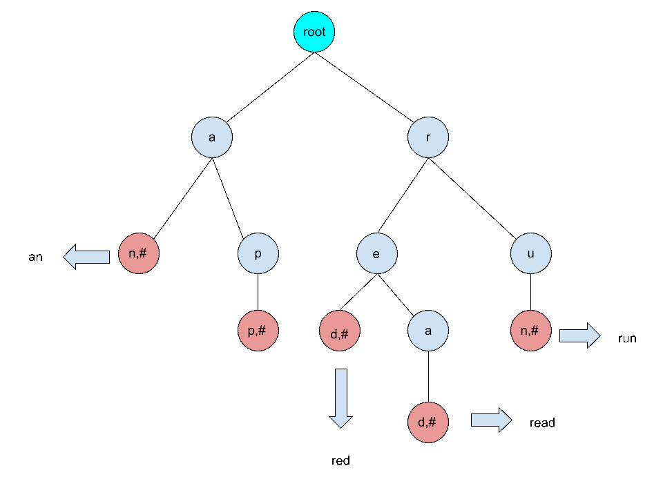
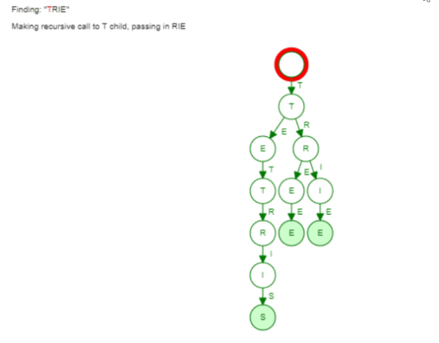

# Prefix Trees (Tries)

## 🕑 Agenda

1. [🕑 Agenda](#-agenda)
1. [\[**5m**\] 🏆 Objectives](#5m--objectives)
1. [\[**20m**\] ☀️ **Warm Up**: Trie Brainstorm](#20m-️-warm-up-trie-brainstorm)
1. [\[**20m**\] 💬 **TT**: Prefix Trees (Tries)](#20m--tt-prefix-trees-tries)
   1. [Trie Definition \& Use Cases](#trie-definition--use-cases)
   1. [How Tries Work (Whiteboard)](#how-tries-work-whiteboard)
   1. [Node Structure](#node-structure)
   1. [Basic Operations](#basic-operations)
   1. [Time Complexities](#time-complexities)
   1. [Space Complexity](#space-complexity)
   1. [Comparison to Hash Tables](#comparison-to-hash-tables)
   1. [Prefix Operations](#prefix-operations)
   1. [Simple Example in Code](#simple-example-in-code)
1. [\[**10m**\] 🌴 **BREAK**](#10m--break)
1. [\[**45m**\] 💻 **Activity**: Implement PrefixTreeNode \& PrefixTree](#45m--activity-implement-prefixtreenode--prefixtree)
1. [\[**15m**\] 📖 Project Checkin \& Solutions Review](#15m--project-checkin--solutions-review)
1. [📚 Resources \& Credits](#-resources--credits)

## [**5m**] 🏆 Objectives

1. Define what a prefix tree (trie) is and explain its key advantages for string operations.
2. Understand the structure of a trie node and how it connects to form a tree.
3. Implement basic trie operations like insert, contains, and complete.
4. Apply trie concepts to solve string-related problems efficiently.

## [**20m**] ☀️ **Warm Up**: Trie Brainstorm

1. Think about how you might store words like "cat", "car", "cab" for fast lookup. What data structure could share common prefixes?
2. Why might a tree be better than a list for autocomplete features (e.g., search suggestions)?
3. Predict what happens if you insert "hello" and "help" into a structure that shares prefixes. Draw a quick sketch and discuss if time allows.

## [**20m**] 💬 **TT**: Prefix Trees (Tries)

> **Tries are like family trees for strings – they share roots for common beginnings, making lookups super fast!**

### Trie Definition & Use Cases

- A prefix tree (trie) is a tree where each node represents a character in a string.
- Keys (strings) are stored by paths from root to leaf/terminal nodes.
    - **BASIC TREE VOCABULARY:**
        - **Root** node: the top node, no parent
        - **Parent** node: has children
        - **Leaf or terminal** node: has no children
        - **Internal** node has at least one child _(synonym for parent)_

    - **TRIE SPECIFIC VOCABULARY:**
        - the word **terminal** is used in a specific way when discussing tries:
            - refers to **a flag on the node**
            - **not a statement about if child nodes exist**

- Great for: autocomplete, spell-checking, or any prefix-based searches (faster than lists or hashes for large word sets).

### How Tries Work (Whiteboard)

- Root node is empty (no character).
- Each edge is a character; children nodes store the next chars.
- Example: Insert "cat" → root -c→ node -a→ node -t→ terminal node.
- Shared prefixes: "cat" and "car" share "ca" path, then branch at 't' vs 'r'.
- Depth = string length; no collisions like hashes.





### Node Structure

- Each node has:

  - A character (or empty for root).
  - Children: a dict (map) of char to child nodes.
  - Terminal flag: True if a word ends here.

### Basic Operations

- **Insert(string)**: Start at root, add nodes for each char if missing, mark end as terminal.
- **Contains(string)**: Traverse chars; if path exists and ends terminal, return True.
- **Complete(prefix)**: Find prefix node, then DFS to collect all full words from there.

### Time Complexities

- Insert: O(L), where L is string length (traverse each char).
- Search/Contains: O(L).
- Delete: O(L).
- Autocomplete (complete prefix): O(L + M), where M is nodes traversed for completions.

### Space Complexity

- Worst case: O(N _L_ A), where N is strings, L is avg length, A is alphabet size (if fixed array per node).
- Average: O(total characters across all strings), using maps for children (shared prefixes reduce nodes).
- Root + nodes per unique prefix path; terminals don't add extra space.

### Comparison to Hash Tables

- **Space**: Tries use O(total unique characters) via prefix sharing; worst O(N_L_A) with arrays. Hash tables use O(N*L), no sharing, plus bucket overhead; stores full strings independently.
- **Time (for strings of length L)**: Both O(L) for insert/search/delete (trie: traversal; hash: compute hash + insert). Tries excel in prefix operations (e.g., autocomplete O(L + results)); hashes do not natively support.

### Prefix Operations

- Prefix operations leverage shared paths for efficiency:

  - **Prefix search**: Traverse nodes matching prefix chars; check if path exists (O(L) time, L=prefix length).
  - **Autocomplete (complete)**: Find prefix node, then DFS/BFS to collect all descendant strings (O(L + M), M=results size).
  - **Longest prefix match**: Traverse to deepest matching node for queries like routing.

- Tries excel here due to prefix compression, unlike hashes.

### Simple Example in Code

Quick demo (we'll implement fully in activity):

```python
# Basic insert
def insert(root, word):
    node = root  # Start at root
    for char in word:  # For each char
        if char not in node.children:  # If no child
            node.children[char] = Node(char)  # Add new node
        node = node.children[char]  # Move to child
    node.terminal = True  # Mark as word end
```

## [**10m**] 🌴 **BREAK**

## [**45m**] 💻 **Activity**: Implement PrefixTreeNode & PrefixTree

Using the starter code provided (`prefixtreenode.py` and `prefixtree.py`):

1. Implement `PrefixTreeNode`
    1. properties: `character`, `children(dict)`, `terminal`
    2. methods: `is_terminal()`, `num_children()`, `has_child(char)`, `get_child(char)`, `add_child(char, node)`.
2. Run `pytest prefixtreenode_test.py` and fix failures.
3. Implement `PrefixTree`
    1. properties:  `root`, `size`.
    2. methods: `is_empty()`, `contains(string)`, `insert(string)`, `complete(prefix)`, `strings()`.
    3. helpers:` _find_node(string)`, `_traverse(node, prefix, visit)`.
4. Run `python prefixtree.py` for small test; then `pytest prefixtree_test.py`.
5. Add your own tests for edge cases (empty string, single char).

If finished early, try the stretch: implement `delete(string)`.


## [**15m**] 📖 Project Checkin & Solutions Review

- **Students**: Share progress on implementation. Ask questions to get unblocked.
- **Instructor**: Review key solutions.

<!--
### Solutions for Tries Challenges

_These solutions are basic – explain line-by-line in class._

#### PrefixTreeNode

```python
class PrefixTreeNode:
    CHILDREN_TYPE = dict  # Use dict for children

    def __init__(self, character=None):
        self.character = character  # Char for this node
        self.children = PrefixTreeNode.CHILDREN_TYPE()  # Empty dict
        self.terminal = False  # No word ends here yet

    def is_terminal(self):
        return self.terminal  # Check if word ends

    def num_children(self):
        return len(self.children)  # Count children

    def has_child(self, character):
        return character in self.children  # Check for child

    def get_child(self, character):
        if self.has_child(character):
            return self.children[character]  # Get child
        raise ValueError("No child found")  # Error if none

    def add_child(self, character, child_node):
        if self.has_child(character):
            raise ValueError("Child exists")  # Error if already there
        self.children[character] = child_node  # Add child
```

#### PrefixTree

```python
class PrefixTree:
    def __init__(self):
        self.root = PrefixTreeNode()  # Root node
        self.size = 0  # Number of words

    def is_empty(self):
        return self.size == 0  # Check if empty

    def _find_node(self, string):
        node = self.root  # Start at root
        depth = 0  # Chars matched
        for char in string:  # For each char
            if node.has_child(char):  # If child exists
                node = node.get_child(char)  # Move to it
                depth += 1  # Count match
            else:
                break  # Stop if no child
        return node, depth  # Return node and matches

    def contains(self, string):
        node, depth = self._find_node(string)  # Find path
        return depth == len(string) and node.is_terminal()  # Full match and end?

    def insert(self, string):
        node = self.root  # Start at root
        for char in string:  # For each char
            if not node.has_child(char):  # If no child
                child = PrefixTreeNode(char)  # Make new
                node.add_child(char, child)  # Add it
            node = node.get_child(char)  # Move down
        if not node.is_terminal():  # If not already end
            node.terminal = True  # Mark as end
            self.size += 1  # Add to count

    def _traverse(self, node, prefix, visit):
        visit(prefix)  # Call visit function
        for char in sorted(node.children):  # Go through children
            child = node.get_child(char)  # Get child
            self._traverse(child, prefix + char, visit)  # Recurse

    def complete(self, prefix):
        results = []  # List for results
        node, depth = self._find_node(prefix)  # Find prefix node
        if depth != len(prefix):  # If no full prefix
            return results  # Empty list
        if node.is_terminal():  # If prefix is a word
            results.append(prefix)  # Add it

        def collect(suffix):  # Helper to collect
            current = prefix + suffix  # Build full string
            # Get node for current (simple but may be slow)
            node_at_suffix = self._find_node(current)[0]
            if node_at_suffix.is_terminal():  # If word ends
                results.append(current)  # Add to list

        self._traverse(node, "", collect)  # Traverse from node
        return results  # Return all matches

    def strings(self):
        all_strings = []  # List for all words
        def visit(current):  # Helper
            # Get node for current
            node = self._find_node(current)[0]
            if node.is_terminal():  # If word ends
                all_strings.append(current)  # Add it

        self._traverse(self.root, "", visit)  # Traverse whole tree
        return all_strings  # Return list
```
-->

## 📚 Resources & Credits

- [BaseCS: Trying to Understand Tries](https://medium.com/basecs/trying-to-understand-tries-3ec6bede0014)
- [Julia Geist: Trie (Prefix Tree) Algorithm](https://medium.freecodecamp.org/trie-prefix-tree-algorithm-ee7ab3fe3413)
- [USF Interactive Trie Animations](https://www.cs.usfca.edu/~galles/visualization/Trie.html)
- Starter Code: prefixtreenode.py & prefixtree.py (as provided)
